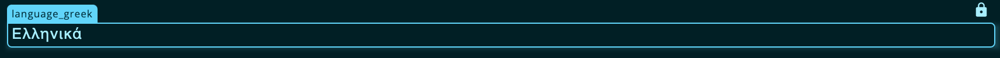
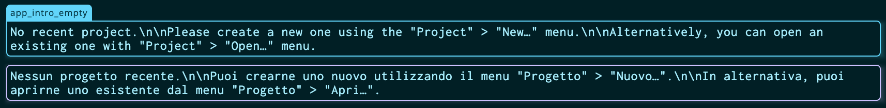
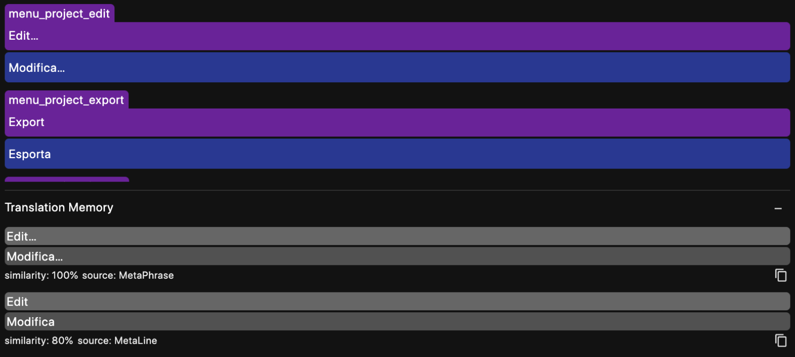
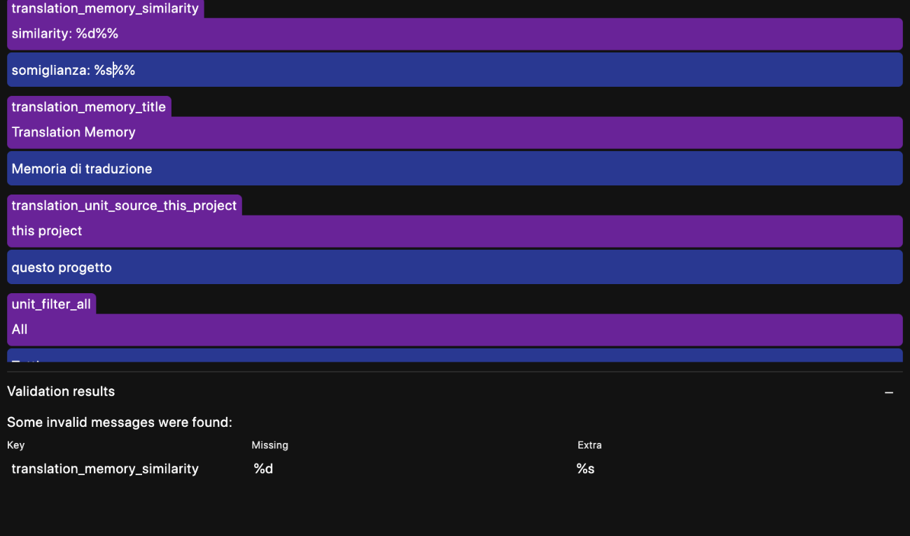

# Key features

## Editor

The translation editor is the main screen of the application and it has two modes: the source (base) mode and the target (localized) view. 

The source mode does not allow to insert any translation but, instead, to change the source messages. It is intended for developers and project managers, whenever they need to update the source text. An update in the source text will affect all the target languages. It this mode, only the message key and source text are displayed and messages can be marked as "unstranlatable", making them disappear in the target languages.

Conversely, the target mode allows translators to insert  a localized version of each message for the translatable messages. For each message the key and source text are displayed (but can not be changed) whereas the translation in the target language can be modified.

## Import / Export

MetaPhrase is designed to integrate in the most frictionless way with the standard localization formats used for mobile application development: iOS stringtables (aka `Localizable.strings`) and string resources on Android (aka `strings.xml`). For this reason, the (de)serialization from and to this format is built-in, to the point that the application uses an Android-style XML format for its own localization.

MetaPhrase can import from and export to both formats allows users to manage some of the properties that these formats allow (e.g. marking some strings as untranslatable which on Android is achieved with the `translatable="false"` attribute).

## Translation memory

Fuzzy matching in the translation memory (TM) is a key feature to ensure consistency both in-project and across different projects and to leverage the work that has already been done (this speeding up the localization process). The content of the TM panel is updated every time a new messages is opened for translation and shows all the matches that are above a similarity threshold (configurable in the settings screen).

The best match can be inserted via a shortcut and can be modified afterwards if needed. In addition to the "Matches" panel, the content of the TM can be browsed and searched as if it was a concordancer from the "Memory" panel.

## Glossary

Glossaries can be considered the second golden tool to ensure consistency and save work. Whenever a message is opened for modification, the source text is analyzed and its words are stemmed, then matched against the content of the application glossary to show correspondences in the glossary panel.

Glossary entries can be added on the fly by selecting a term in the editor, right-clicking on it and selecting the "Add to glossary" menu item.

## Validation

One of the most important features of this project is the placeholder validation. Placeholders are indicated by special sequences of characters (known as *format specifiers*) such as `%1$d` or `%2$s` that convey information both about their position (the optional digit before the `$` sign) and the data type (the letter after the `%` sign). An error in a format specifier by the side of the translator may lead to the application crashing or failing to display the message properly, so their correctness if of vital importance for the localization.

When running the placeholder validation, MetaPhrase scans all the messages in the current localized variant of the project and detects whenever a placeholder is missing or has been erroneously added in the target message. By clicking on each row in the panel, the editor will scroll to the corresponding message for the translator to correct the mismatch.

In addition to placeholder validation, it is also possible to run a global spelling check on all the localized strings. Spelling is also checked whenever any message is opened for editing.
