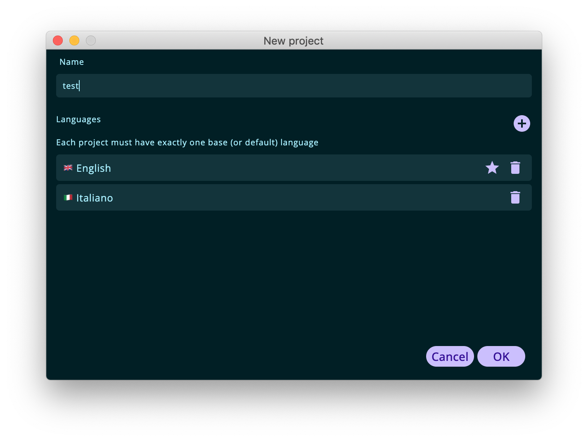

## Project configuration

You can create a new project by using the "Project" > "New…" menu. This will open a dialog where it is possible to insert a name and select the project languages.

    

The first language that is selected will be considered the base (source) reference language and it is marked with a flag icon. When more than one language have been inserted, by clicking on an item, it will be promoted to be the base language.

The same dialog will be used when editing an existing project ("Project" > "Edit…" menu) and the fields will be prefilled with the current project configuration. New languages can be added at any time and the base language can be edited if you change your mind.

Each project can be saved to disk for persistence. MetaPhrase is designed to be as interoperable as possible with other CAT tools, so you wouldn't be surprised to know that the native format it uses for translation projects is the TMX (Translation Memory eXchange).

After being saved to file, a project can be opened at a later stage. The application will remember the latest projects names and path and will display them in the project list screen.