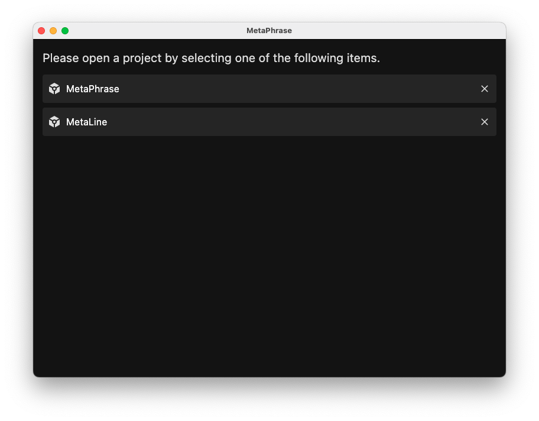

## Project list

When at least one project has been created, the main screen displays the project list.

If you click on a row, the corresponding project will be opened for translation. By clicking on the trash bin icon, on the other hand, it is possible to delete a project. If you delete a project all the corresponding  messages will be deleted too and it won't be possible to edit them again unless you create a new project and import the same resource files again.
