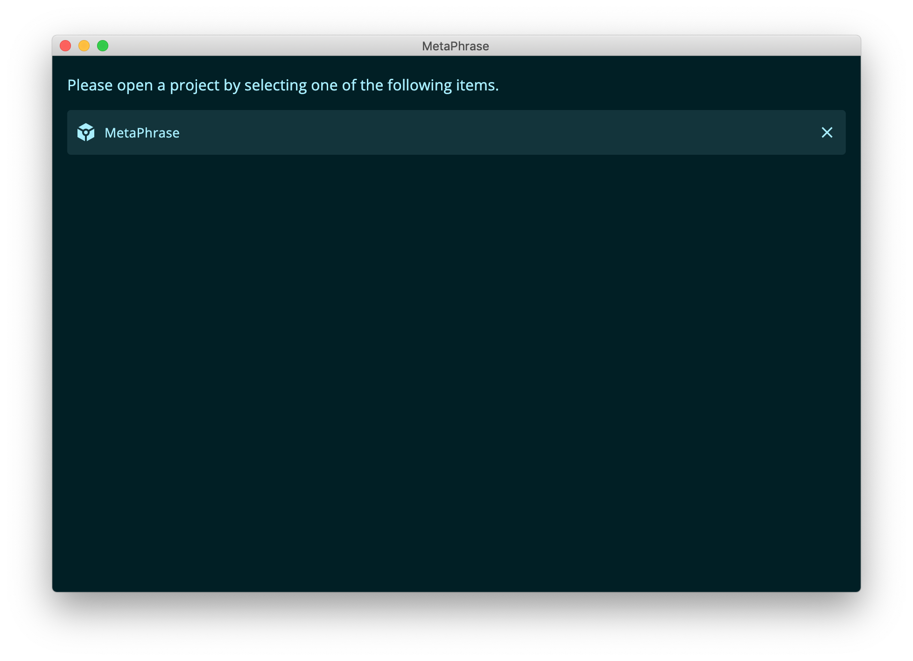

## Project list

When at least one project has been created and opened, the main screen displays the list of the recent projects. In this list, there are some shortcuts to the most recently used projects.

If you click on a row, the corresponding project will be opened for translation. By clicking on the cross icon, on the other hand, it is possible to remove a project from the recent list. This list is updated whenever you create a new project and save it to disk or when you open an existing project.
