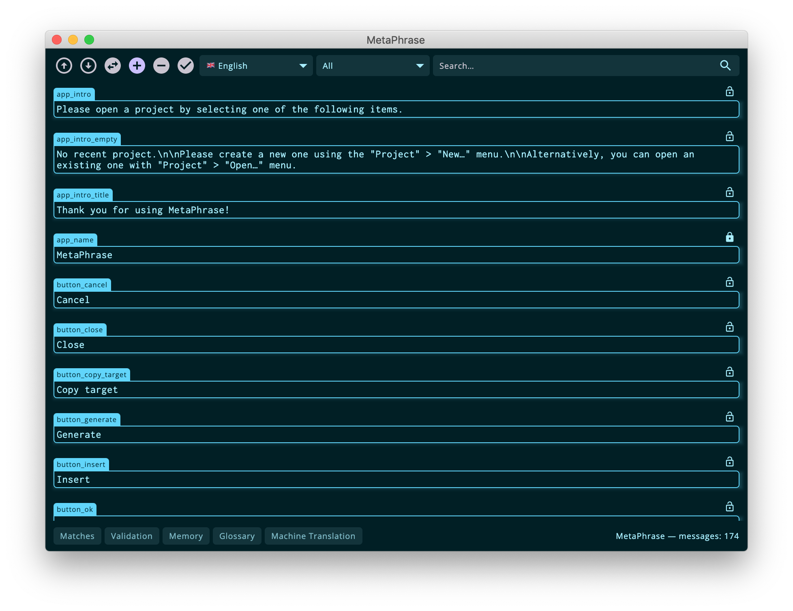
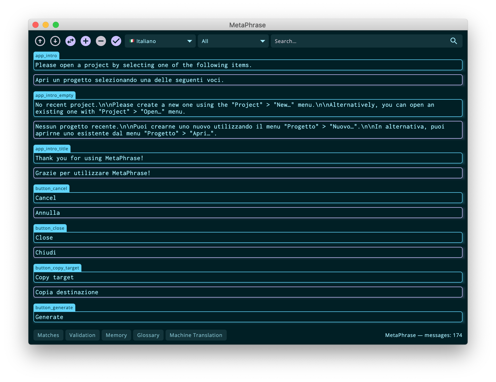
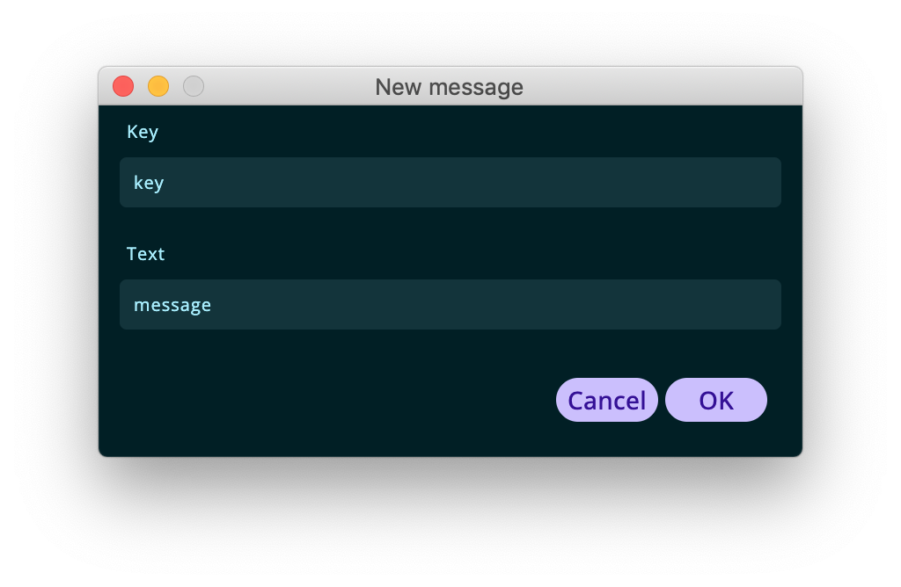

## Translation editor

After importing one or more resource files the message list will be populated in the translation editor. This same screen will also be displayed whenever opening an existing project which already contain some messages.

The translation editor is made up by two parts: the [translate toolbar](#translation-toolbar) and the[ message list](#message-list). The bottom part of the translation screen contains the status bar which displays the name of the project (prefixed with an asterisks if there are unsaved changes) and the translation unit count.

### Translation toolbar

In the first place, the translation toolbar contains some shortcuts for the main functions of the editor: 
- Move to previous segment: moves the focus to the previous segment, if any
- Move to next segment: moves the focus to the next segment, if any
- Copy source: copies the source text in the target message field
- Create segment: opens a dialog to insert a new message by specifying the key and source text
- Delete segment: deletes the current segment
- Validate placeholders: starts a placeholder validation, the results of which will be displayed in the [Validation](#validation) panel.

Secondly, the toolbar contains the language selector, which allows you to change the current language being edited. The language has an impact on what will be imported / exported, the fuzzy matches displayed in the Matches panel and the glossary terms.

In the third place, the toolbar allows to filter messages by state:

- **All**: displays all the messages regardless of their translation status
- **Untranslated**: displays only the translatable messages that do not contain any target message and need to be translated
- **Translatable**: filters out all the untranslatable messages (this is the default for local languages).

Finally, the toolbar contains a search field that allows to filter any message containing a substring in the key, source variant or target variant. 

### Message list

The message list displays a set of messages that can be modified or translated. It has two modes depending on whether the current language (in the toolbar language selector) is the base language or a target language. If the current language is the base language the editor will work in **source mode** otherwise, if a local language is selected, the editor will work in **target mode**.

 The key of each message is always displayed in both modes to provide some context: if the developers used some sensible conventions, the key may give some *hints* about the string role in the UI, e.g. whether it is a dialog title or a field placeholder, etc.

#### Source mode

When the source language is selected, the editor allows to modify the source variant of each translation unit. Additionally, some messages can be marked as untranslatable using the lock icon on the right side of each item, implying that they will not be displayed for translation in the editor target mode.

Whenever a message is being edited its spelling is checked and errors are displayed in red. By right-clicking on an error it is possible to insert a suggestion.

#### Target mode

When a non-base language is selected in the toolbar, messages are edited in their localized version and the base message is displayed as the source text and can not be changed.

Whenever a message is being edited, apart from spelling mistakes, the source language is matched against the content of the translation memory (TM) and the matches above the similarity threshold are displayed in the Matches panel (more on this [here](#matches-panel)). Any term present in the glossary is displayed in the Glossary panel (more on this [here](#glossary)).

### New segment creation

It is possible to add new messages specifying a key and the source message. This is more useful to project managers or developers than to individual translators, but is offers a handy shortcut to insert new messages without having to re-import resource files.

    

