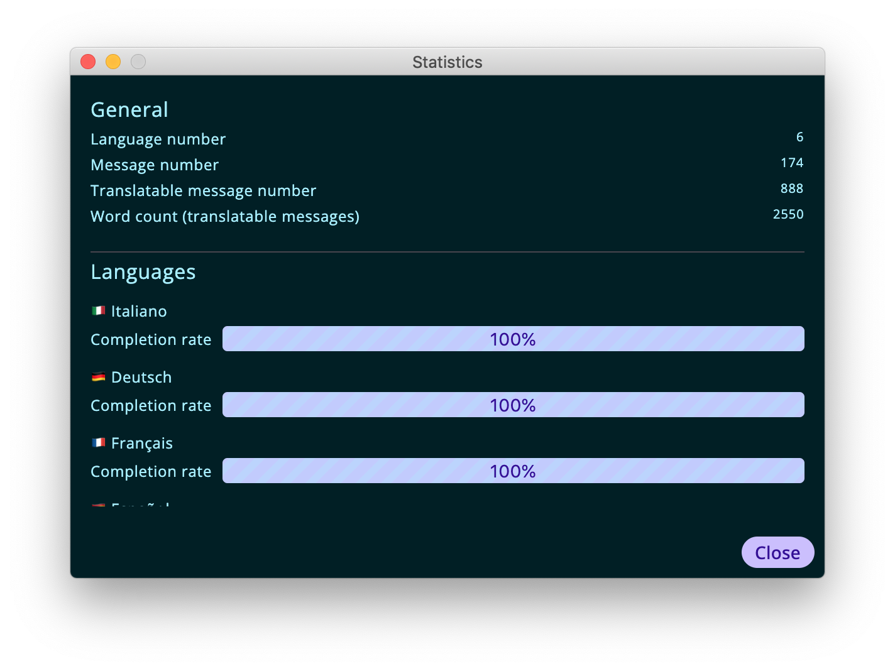

## Statistics

The statistics dialog can be accessed via the "Project" > "Statistics…" menu item. It displays a set of overall statistics for the project (all languages) as well as some language-dependant information.

    

The general statistics being displayed are the following:
- number of languages
- total number of messages
- number of translatable messages (defined as total number of messages - number of messages marked as untranslatable)

Then, for each language in the project, a completion rate is calculated corresponding to the percentage of messages for that language that have a non-empty translation over the number of translatable messages. 
