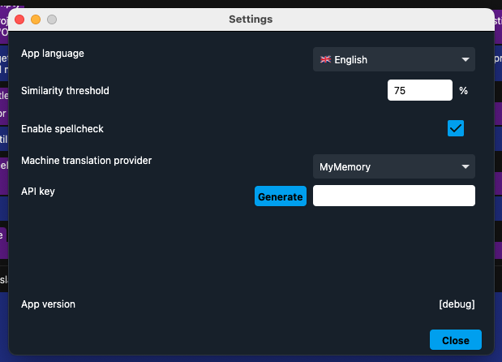
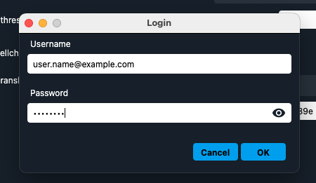

## Settings

The settings dialog allows to configure the application appearance and behaviour, in particular users can:
- change the application UI language (defaults to system language)
- configure the minimum similarity threshold for segments to be displayed in the Matches panel as fuzzy matches, items with a score lower than this threshold will be filtered out (defaults to 75%)
- select a provider for Machine Translation and specificy an API key for the retrieval of messages
- see the application version for bug reporting purposes.

If you are using the MyMemory machine translation provider, the application offers a shortcut to generate an API key for your user. Please use the generate button and insert your credentials (which will not be saved anywhere), afterwards the key will be visible in the corresponding field.

