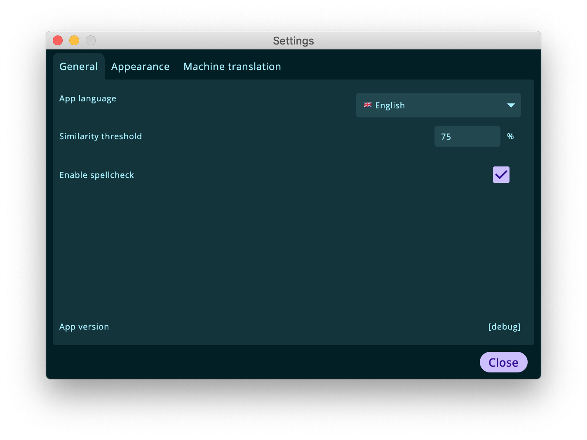
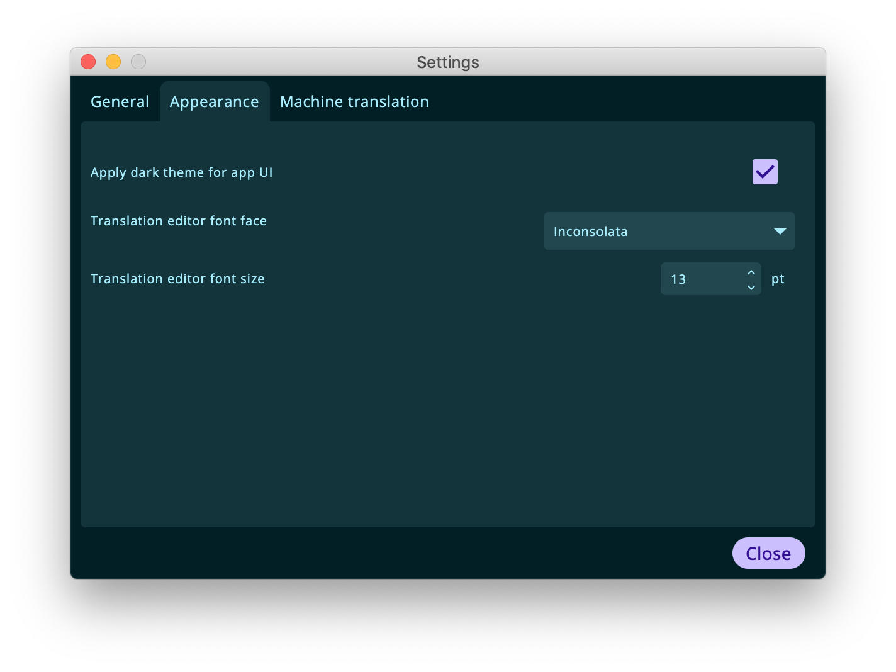
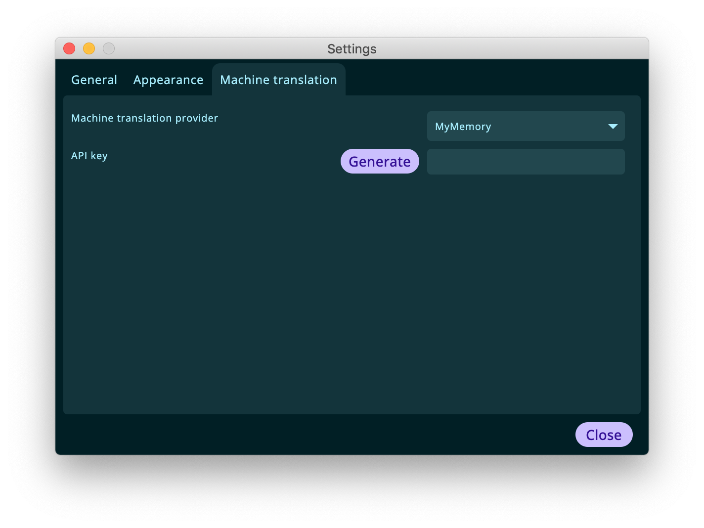
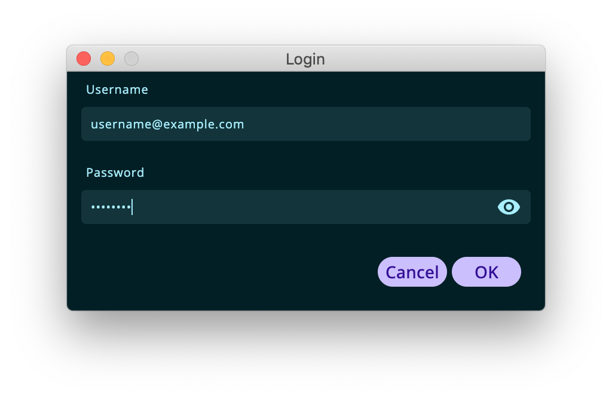

## Settings

The settings dialog allows to configure the application appearance and behaviour. The dialog is divided into tree tabs that refer to different functions of the application.

The "General" settings tab allows users to:
- change the application UI language (defaults to system language)
- configure the minimum similarity threshold for segments to be displayed in the Matches panel as fuzzy matches, items with a score lower than this threshold will be filtered out (defaults to 75%)
- see the application version for bug reporting purposes.

    

The application look and feel can be customized in the "Appearance" tab, which allows users to:
- switch between dark and light UI themes
- change the editor font face
- change the editor font size

    

Finally, the "Machine translation" tab allows users to configure the settings for machine translation:
- select a provider for the retrieval of messages
- specifiy an API key for the above mentioned provider

    

If you are using the [MyMemory](https://mymemory.translated.net/) machine translation provider, the application offers a shortcut to generate an API key for your user. Please use the generate button and insert your credentials (which will not be saved anywhere), afterwards the key will be visible in the corresponding field.

    

