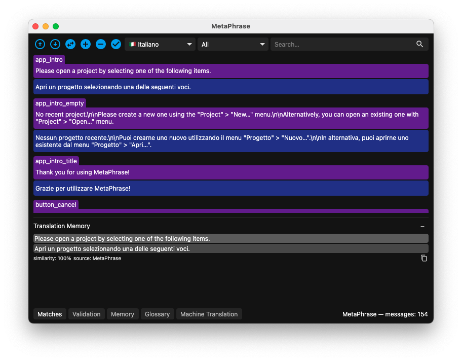
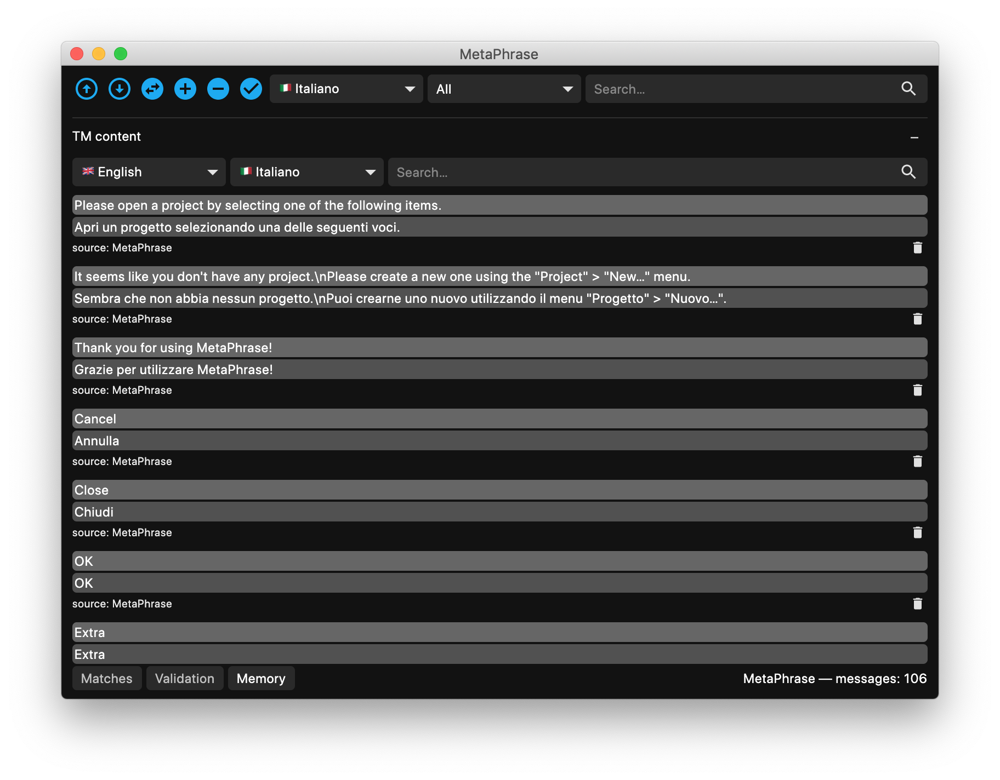

## Translation Memory

MetaPhrase contains a translation memory (TM) feature to reuse existing translations across projects or within the same project. Users can interact with the TM two ways: either examining fuzzy matches during the translation in the "Matches" panel or browsing the its content in the "TM content" panel.

### Matches panel

This panel displays all the entries in the translation memory that are similar to the currently edited message with a rage higher than the threshold configured in the settings dialog.

The best match can be inserted via the "Memory" > "Insert best match" menu, every other match can be copied to the target field via the copy button.

How is the TM populated? During the translation process, all the messages are saved internally and if a message has a source segment with a similarity rate higher than or equal to the threshold value configured in the settings dialog, they are displayed as internal matches with the label "origin: this project".

Additionally, the application has a global TM shared across all projects which works in a similar fashion. All the entries of a project can be added to the global TM using the "Memory" > "Sync project with TM" menu item, e.g. when the translation is finished and all the strings are validated.

### TM content panel

The TM content panel allows users to browse the TM content as if it were a bilingual corpus and look for concordances.

In this mode, no similarity is taken into account for displaying the memory entries. Instead, by selecting a linguistic combination (source/target languages) and optionally a textual query it is possible to browse the content of the TM.

This comes in handy for when you want to remember how you translated a given piece of content which is not (yet) in the glossary or if you want to consult some message no matter the similarity with the currently opened message in the editor.

### TM import / export

MetaPhrase can also export all the messages of a project as a multilingual translation memory in the TMX (Translation Memory eXchange) format with the "Memory" > "Export" menu item. Moreover, individual TMX files can be imported in the global translation memory by means of the "Memory" > "Import" menu item. In this case, the origin displayed in the memory panel corresponds to the name of the TMX file imported without the `.tmx` extension.
