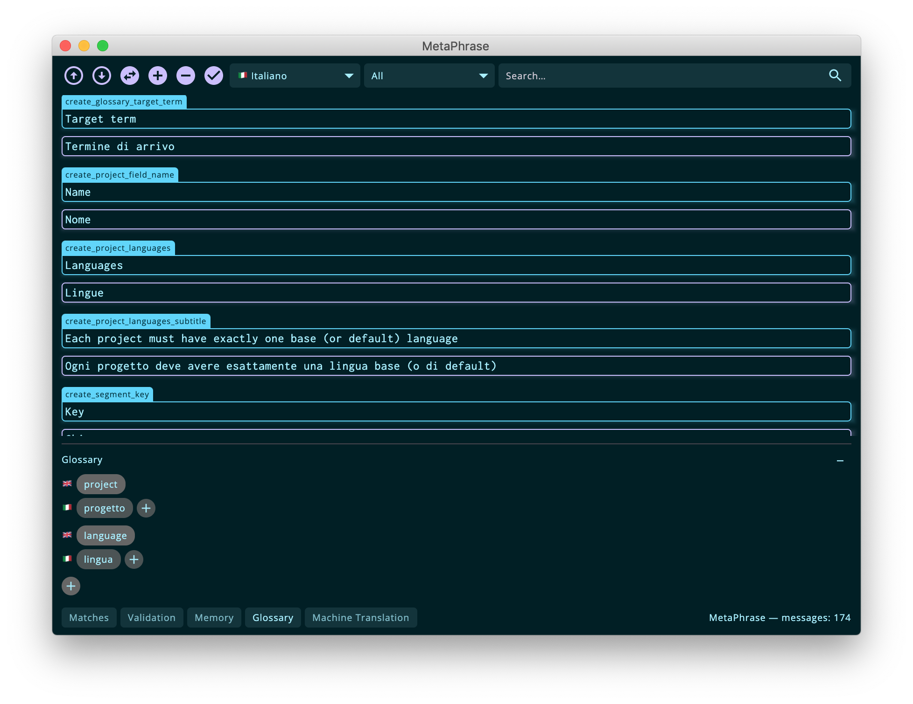

## Glossary

The glossary panel is updated every time a message is opened for translation. The source variant is scanned word-by-word and each word is first stemmed according to the rules of the source language, then it is looked for in the internal glossary for matches against the target language. If you are working with the editor in "source mode", then only source terms are displayed and there are no target counterparts.

It is possible to have _m:n_ associations between terms so multiple target entries can exist for a single source term. By using the "+" button it possible to add both source terms and target terms, whereas by right-clicking on a term it is possible to delete it permanently.

You can quickly add new terms to the glossary without having to type them in: simply select a term in the translation editor, right-click on in and select the "Add to glossary" item from the context menu. If you are working in the source language (source mode) the term is added immediately to the glossary, if you are working in a target language, you will be given the opportunity to add the source term in a dialog.

Finally, MetaPhrase offers the possibility to import and export glossaries in CSV. It is important that each file should start with a "header" containing the language 2 character locale codes.
