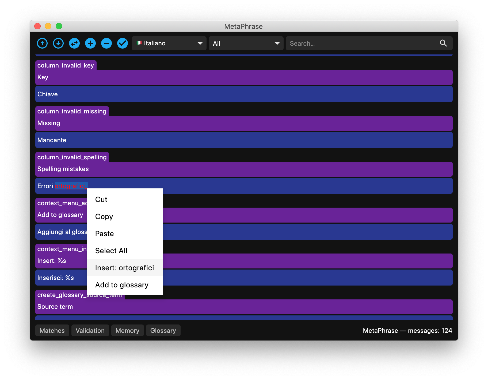
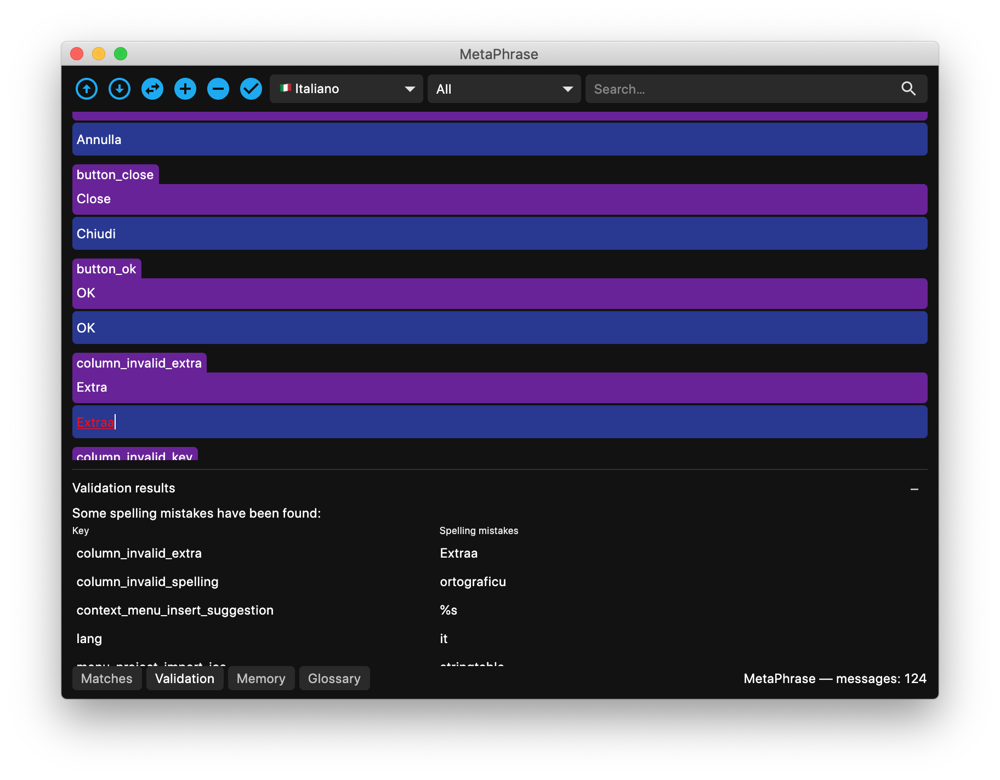

## Spellcheck

MetaPhrase contains a spelling checker function (that can be enabled or disabled in the settings dialog). If the current language is supported, whenever a message is opened for translation it is checked for spelling and, should errors be found, the corresponding words will be highlighted in red and underlined. By right-clicking on a spelling error, it will be possible to insert one of the suggestions from the context menu. 

 If you want to add a specific term to your custom dictionary (not to receive any more warning about that word being misspelled) you can add save it into your user defined words by right clicking on it and selecting the "Ignore" context menu item.

It is also possible to run a global spellcheck with the "Project" > "Check spelling" menu to inspect all the errors found in the validation panel. By clicking on each row the translation editor will scroll to the corresponding message to correct it.

