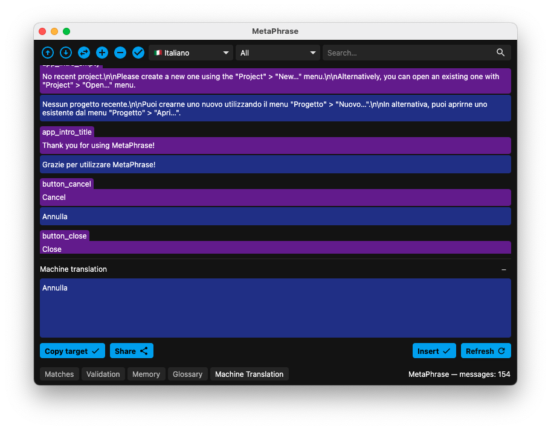

## Machine translation

Another way in which the application may facilitate the translation task if by means of providing suggestions from machine translation services. It is possible to retrieve a suggestion for the currently opened message with the "Retrieve" button (or "Refresh" if a translation is already present in the field). You can edit the suggestion and copy it to the editor with the "Insert" button.

The bottons in the left side, on the other hand, allow to copy the existing translation to the suggestion field ("Copy target") and, if you want, to share the translation with the machine translation service ("Share").
