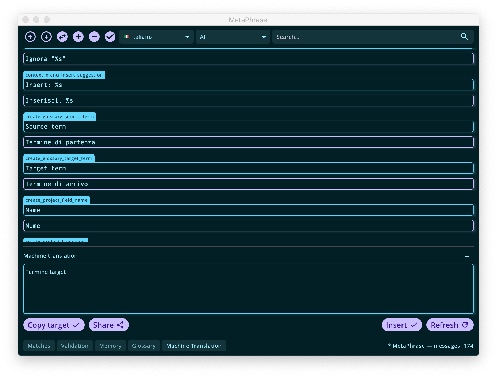

## Machine translation

Another way in which the application may facilitate the translation task if by means of providing suggestions from machine translation (MT) services. The two MT providers supported are:
- [MyMemory](https://mymemory.translated.net/) which has great APIs and documentation and supports both obtaining results and submitting new segments and whole TMs
- [DeepL](https://www.deepl.com/it/translator) which supports translation retrievals via API. 

 It is possible to retrieve a suggestion for the currently opened message with the "Retrieve" button (or "Refresh" if a translation is already present in the field). You can edit the suggestion and copy it to the editor with the "Insert" button.

The bottons in the left side, on the other hand, allow to copy the existing translation to the suggestion field ("Copy target") and, if you want, to share the translation with the machine translation service ("Share"). This is not available for all providers, depending on the operations that are supported by the provider APIs.

If you choose to do so, thank you for your generosity!
